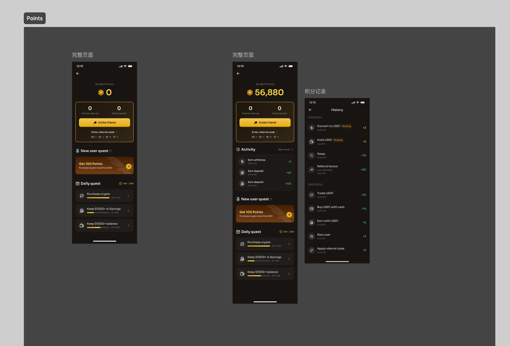

## 需求 

总设计稿：




## 2 个页面：

1. 默认首页：从上到下模块依次为 [my points](./my points.png), [invite friends](./invite.png), [new user reuqest](./new user.png), [daily request](./daily request.png)
1. 点击顶部 my points 进入 [points records](./activity.png);


分模块需求说明：

1.   my points：读取接口 A01,  ui: https://www.figma.com/design/YvaX5joHmqZfcFSsHobQ4W/NEW--WLFI-App?node-id=28818-175259&t=udDAnfkv3pCALxNQ-4
2.   points records：读取接口 A01, ui: https://www.figma.com/design/YvaX5joHmqZfcFSsHobQ4W/NEW--WLFI-App?node-id=28825-40635&t=udDAnfkv3pCALxNQ-4
3.   invite friends：调用 flutter 系统模块，分享 app 链接+ current user code, ui: https://www.figma.com/design/YvaX5joHmqZfcFSsHobQ4W/NEW--WLFI-App?node-id=28818-175264&t=udDAnfkv3pCALxNQ-4
4.   new user request：一个特殊的 actvity, ui: https://www.figma.com/design/YvaX5joHmqZfcFSsHobQ4W/NEW--WLFI-App?node-id=28818-175053&t=udDAnfkv3pCALxNQ-4
5.   daily request： 今天可用的 actvity, ui: https://www.figma.com/design/YvaX5joHmqZfcFSsHobQ4W/NEW--WLFI-App?node-id=28818-175054&t=udDAnfkv3pCALxNQ-4


## 接口定义

baseUrl = "https://wlfi.com/test/api/points";

A01: /mypoints 返回总积分，以及积分获取记录

```
get: /mypoints 
response: {
	code: 0,
	data: {
		points: 12345,
		list: [{
			activity-id,
			logo, title, tx_time, stauts, points
		}],
		total: 234,
		pageSize: 30,
		pageNumber: 0
	}
}
```


A02：/activities 返回可用的活动

```
get: /activities 
response: {
	code: 0,
	data: {
		list: [{
			activity-id,
			logo, title, tx_time, stauts, points
		}],
		total: 24,
		pageSize: 30,
		pageNumber: 0
	}
}
```


